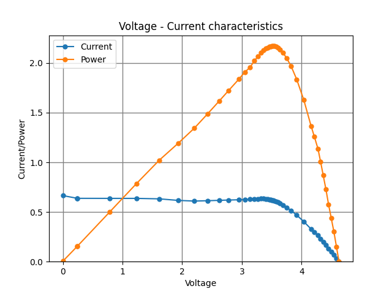

### Authors

Paweł Wojaczek -- https://gitlab.com/pwojx  
Szymon Ciemała -- https://github.com/szymciem8

# PV-characteristic
Fast measuring method of creating voltage-current characteristic of a solar panel.

## Problem and solution

During measurement process in a artificial enviroment (lights), solar panel is heated, which changes its parameters. In order to create proper charecteristic, couple of conditions have to be met:

- Consistent parametrs of a panel
- Enough CH points

To adhere to those conditions, time of the procedure must be as short as possible. The problem of numer of points was solved by focusing on measurement of given part of the CH, mainly the surroundings of the working point (highest power output).

## Example 

